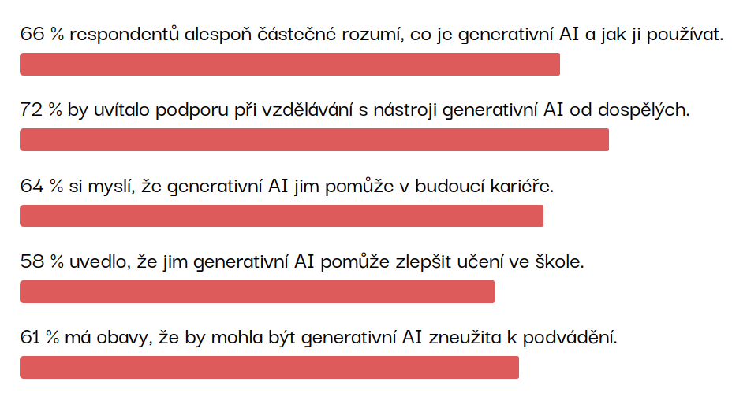
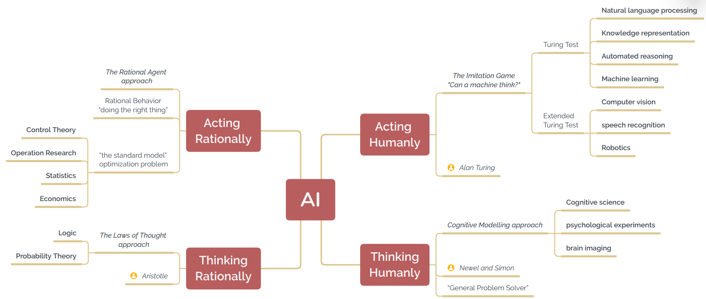
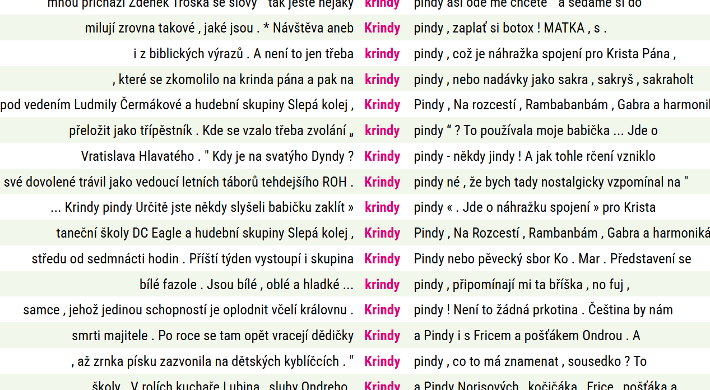
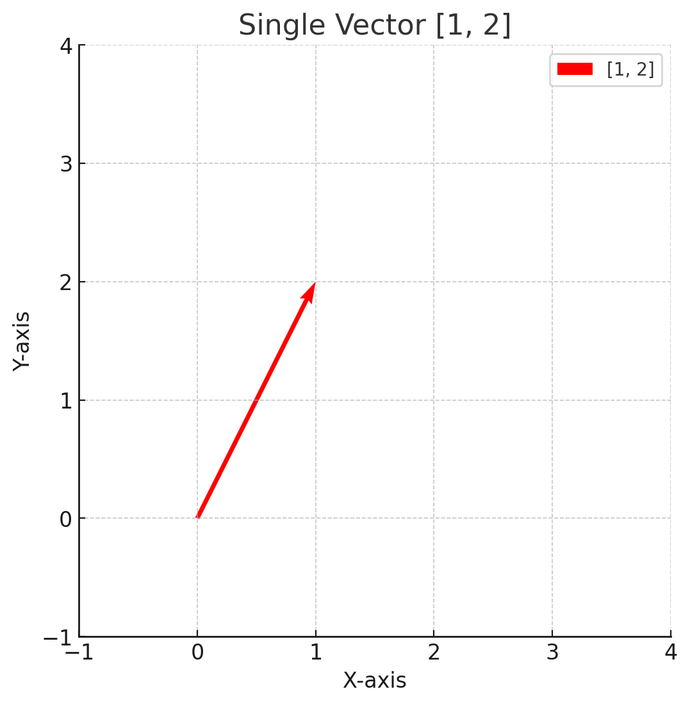
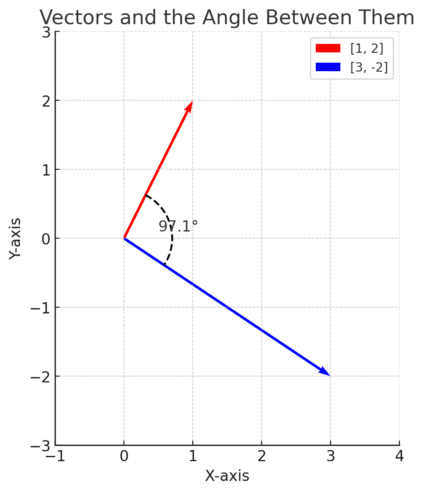
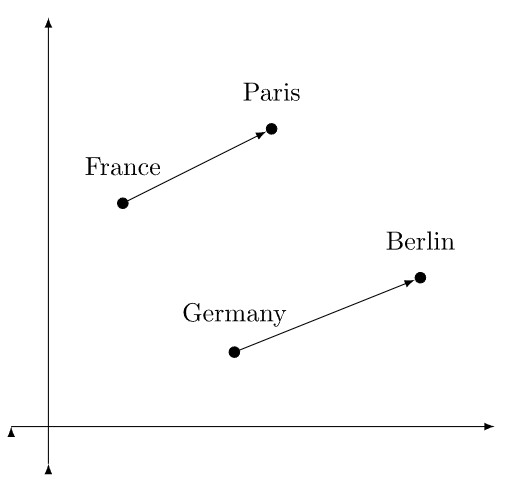
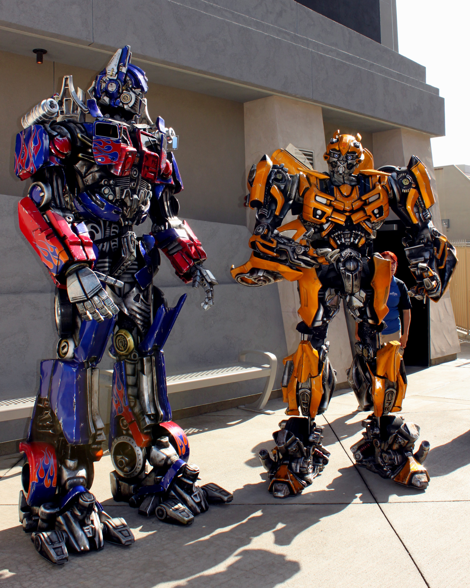

# Jak rozumíme AI?

výzkum Národní rady 4-H (USA) z roku 2024
------------------

# Kam AI zasahuje

------------------

# Jak a proč AI funguje?

jazykový korpus - datová sada s texty

Texty musí být:
- souvislé
- ideálně v jednom jazyce
- napsané pokud možno lidmi
- dost dlouhé

------------------

## AI je statistický model

### Jednoduchá statistika

Slovo "krindy" se v korpusu SYN v13 vyskytuje 35 krát. Celkem se v korpusu vyskytuje 6 400 899 055 slov.

------------------

### Pokročilejší statistika

- po slově "krindy" se vždy vyskytuje slovo "pindy"
- nejjednodušší jazykový model by mohl pokračovat v generování slovem "pindy", kdykoliv by uživatel napsal "krindy"

------------------

### Statistika a pravděpodobnost

- statistika je měření, pravděpodobnost je odhad

- pravděpodobnost, že ze slovníku vylosuju slovo "krindy" = 35/6400899055 = 5.47e-9
- protože jde o malá čísla, často se používá jednotka p.m. (per million)
- podmíněná pravděpodobnost = jaká je pravděpodobnost, že přijde slovo "pindy", když se v textu objeví "krindy"?

$$
P(''pindy''|''krindy'') = 100 \%
$$

------------------

### Proč zrovna krindy pindy?

- takové "chování" slov je dost vzácné
- většinou má slovo kolem sebe okruh slov ("společnost")
- ta ukazuje, jaký význam slovo má (v kontextu)

> "a word is characterized by the company it keeps"
>
> --- Firth, J.R. (1957)

------------------

### Pokročilejší statistika u běžných slov

| Výraz           | Frekvence | Počet p.m. |
|-----------------|-----------|------------|
| dobrý ,         | 55 762    | 8,71       |
| dobrý .         | 41 731    | 6,52       |
| dobrý výkon     | 35 258    | 5,51       |
| dobrý pocit     | 32 507    | 5,08       |
| dobrý nápad     | 22 402    | 3,5        |
| dobrý výsledek  | 21 626    | 3,38       |
| dobrý zápas     | 13 269    | 2,07       |
| dobrý a         | 12 454    | 1,95       |
| dobrý fotbal    | 12 374    | 1,93       |
| dobrý tým       | 8 638     | 1,35       |
| dobrý dojem     | 7 545     | 1,18       |
| dobrý den       | 6 602     | 1,03       |
------------------

### Ještě pokročilejší statistika

"krindy pindy" není "pindy krindy"

Text je sekvence slov (a neslov)

Záleží nejen na nejbližších sousedních slovech, ale i na širším okolí (kontext).

#### Statistika nad korpusem:

- když je v textu "krindy pindy", budou tam pravděpodobněji *light* nadávky (sakryš, prkotina, ...)
- slovo "dobrý" se často vyskytuje v nabídkách práce
- slovo "dobrý" se často vyskytuje se slovem "velmi"
- v podobných situacích jako "dobrý" se vyskytuje slovo "špatný"

------------------

### Od statistiky po word embeddings

- statistický popis jazykového korpusu
- hledá se vztah všech slov se všemi dalšími
- (některé možnosti se chytře zahodí)
- protože jde o výpočet, nejde počítat se slovy, ta se převedou na *sémantický vektor*
- vektor je řada čísel (délka řady se nazývá dimenze)
- vektory lze vizualizovat
- u sémantických vektorů můžeme počítat jejich podobnost (úhel, který svírají)

------------------

### Odbočka - co je vektor?

{height=450px}

- vektor má délku a *směr* (ukazuje *pohyb*)

------------------

### Odbočka - co je vektor?

{height=450px}

------------------

### Word embeddings

By Fschwarzentruber - Own work, CC BY-SA 4.0, https://commons.wikimedia.org/w/index.php?curid=162969550

------------------

### Word embeddings

- umí sdružit k sobě slova, která jsou si podobná
- moc nevadí překlepy
- mohou být mezijazyková (podobnost mezi "cat" a "kočka")
- stále máme slova reprezentovaná jako vektory (řady čísel)
- samotná čísla uvnitř vektoru nic neříkají
- word embeddings se trénují tak, že neuronovou síť vystavíme textovým datům, a necháme ji naučit se hádat další slovo

------------------

### Využití word embeddings

- našeptávač (další slovo, konec slova)
- vyhledávání (najde dokument s podobnými slovy)
- v dalších neuronových sítích - transformerech

{height=350px}

By prayitno from Los Angeles, USA - Defenders of the UniverseUploaded by themeparkgc, CC BY 2.0, https://commons.wikimedia.org/w/index.php?curid=22523905

------------------

### Transformer (transformátor)

- druh neuronové sítě, který všechno změnil
- díky *attention* dokáže zachytit závislosti mezi slovy, přestože je mezi nimi velká vzdálenost
- aby to bylo možné, musí být transformer dost velká síť
- neuronová síť se trénuje (tj. vystaví datům) - trénink
- natrénovanou síť lze použít pro zpracování nových (dosud neviděných dat) - predikce
