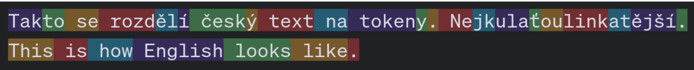

# Jak funguje ChatGPT a jiné generativní modely 

(materiál prezentovaný na Noci vědců 2024 v Centru zpracování přirozeného jazyka, Fakulta informatiky, Masarykova univerzita, Brno)

**Počítačový program, který umí předpovídat další slovo v textu**

* dostane vstupní text / dotaz (prompt) / kontext  
  * pro každé slovo ve slovníku vygeneruje pravděpodobnost, s jakou by mohlo být jako pokračující (pravděpodobnostní rozložení na všech slovech)  
  * vybere z nich to nejpravděpodobnější slovo

  **Opakovaným předpovídáním dalšího slova vygeneruje celý text**

  **Používá neuronovou síť**

  * není klasicky ručně naprogramovaná, co má v různých situacích odpovídat  
  * potřebuje trénovací data ‒ ukázky vstupů a výstupů  
  * trénuje se na textech z internetu, knihách, vědeckých článcích, …  
  * technické informace  
    * inspirováno neurony v mozku  
    * vstup se převede na desetinná čísla  
    * provede se velké množství číselných operací (násobení, sčítání) s natrénovanými konstantami (váhami / parametry)  
    * čísla na výstupu se převedou zpátky na slova  
    * Počet vah/parametrů bývá jednotky až stovky miliard (109 – 1011)  
      (používá se B – anglicky bilion – miliarda parametrů)  
      * nekomprimované 	1B parametrů \-\> 4 GB čísel  
      * po kompresi 		1B parametrů \-\> 0,5 GB čísel  
      * GPT-4o má přes 200 B parametrů

  **Tokeny versus slova**

  * protože jednotlivých slov je příliš mnoho, modely předpovídají tokeny  
    * Čeština má \~300 000 kořenů, celkem několik milionů tvarů   
  * tokeny jsou části slov, získávají se analýzou textu  
  * nejčastější shluky znaků mají svoje vlastní tokeny  
  * každý token má své číslo, které se použije v neuronové síti  
  * většinou se používá celkem zhruba 50 000 různých tokenů  
  * obsahuje např. i emoji a čínské znaky; některé se rozdělí na více tokenů  
  * [https://platform.openai.com/tokenizer](https://platform.openai.com/tokenizer)

  **Délka kontextu**

  * modely mají omezenou délku vstupního textu (kontextu)  
  * omezení na to, jak starý text v konverzaci model *vidí*  
  * GPT-4o používá 128 000 tokenů – cca 128 A4 textu  
  * nároky na výpočet rostou kvadraticky s počtem tokenů v kontextu

**Výpočetní nároky**

* nejefektivnější pro výpočet jsou grafické karty – Ideální pro neuronové sítě, protože umí dělat spoustu podobných operací naráz (paralelně)  
  * i přesto je na větší modely potřeba spojit několik grafických karet  
    * kvůli množství operací  
    * kvůli operační paměti grafických karet (model se na jednu nevejde)  
  * Trénování modelu je několikrát náročnější než jeho používání  
    * nevíme přesně, kolik spotřebovalo GPT4o  
    * např. trénování modelu Llama3.1 405B použilo 8 930 tun CO2eq

                 2 125   benzinových aut na za 1 rok

                 1 165   domácností na 1 rok 

      589 528 990   nabití mobilu

             147 658   stromů rostoucích 10 let

      	   2,4   větrné elektrárny fungující 1 rok (1,88 MW)

      zdroj: https://www.epa.gov/energy/greenhouse-gas-equivalencies-calculator

      

  **Způsob trénování**

  * 1\. krok je modelování textu – predikce následujícího slova  
    * stačí libovolný (kvalitní) text  
  * 2\. krok je trénování na ukázkových konverzacích  
    * ukazujeme, jak by se měl model chovat  
  * 3\. krok je učení se zpětnou vazbou od lidí (RLHF)  
    * model vygeneruje možná pokračování a lidé ukazují, která jsou lepší  
    * s dostatkem dat lze natrénovat druhý model, který dokáže rozlišit kvalitnější odpověď sám

  **Integrace s nástroji** – můžeme modely naučit *používat nástroje*

  * kalkulačka  
  * používání internetového prohlížeče nebo vyhledávače  
  * přístup k databázi s informacemi (RAG)  
  * přístup k programování / počítači

  **Práce s obrázky, zvukem a videem**

  * podobně jako text můžeme na tokeny převést i jiné typy dat, jako jsou obrázky, zvuk nebo dokonce i video  
  * s dostatečným tréninkem se s nimi model naučí pracovat 

**Otevřené modely**

* teoreticky můžete vyzkoušet i u sebe doma  
  * menší modely jedou dostatečně rychle i bez grafické karty  
  * můžete použít např. nástroj **Ollama**

| https://ollama.com/ |
| :---: |

    * modely, co stojí za zmínku (seřazené podle toho, jak umí česky)  
      https://huggingface.co/spaces/CZLC/BenCzechMark  
    * Llama3.1 \[Meta\]  
    * Mixtral \[Mistral AI\]  
    * Mistral \[Mistral AI\]  
    * Qwen2 \[Qwen\]  
    * Aya \[Cohere For AI\]  
    * Hermes3 \[NousResearch\]

| https://huggingface.co/spaces/CZLC/BenCzechMark |
| :---: |

  **Uzavřené modely** – často placené

  https://huggingface.co/spaces/lmsys/chatbot-arena-leaderboard

  * GPT-4o \[OpenAI\] – více než 200 B; kontext 128 K; čeština dobrá  
  * Gemini \[Google\] –  así více než 1 400 B; kontext až 1 ; čeština dobrá  
  * Grok 2 \[xAI\]  
  * Claude 3.5 Sonnet \[Anthropic\]  
  

# Halucinace – Česká hymna

## (ChatGPT, září 2023\)

Jaká jsou slova české hymny?

Slova české hymny, která se nazývá "Kde domov můj?" a je často nazývána též "Hymna České republiky," jsou napsána básníkem Josefem Kajetánem Tylem. Hymna má více slok, ale nejčastěji se zpívá první sloka. Zde jsou slova první sloky:

Kde domov můj, kde domov můj? Voda hučí po lučinách, bory šumí po skalinách, v sadě skví se jara květ, zemský ráj to na pohled\!

Celkem má hymna devět slok, ale veřejně se obvykle zpívají pouze první dvě nebo první sloka.

Jak je další sloka?

Samozřejmě, rád vám přidám další sloku české hymny. Zde je text druhé sloky:

A to je ta krásná země, země česká, domov můj, zde byl zrozen lid proslavený, předků slávy, díků náš žnů.

Tímto jsou pokryty první dvě sloky hymny. Jak jsem zmínil dříve, hymna má celkem devět slok, ale obvykle se veřejně zpívají jen první dvě nebo první sloka.

Jak je třetí sloka?

Omlouvám se za nepřesnost ve své předchozí odpovědi. Skutečně původní česká hymna má pouze dvě sloky, ačkoli existuje několik návrhů na doplnění dalších slok. Takže hymna končí druhou slokou:

"A to je ta krásná země, země česká, domov můj, zde byl zrozen lid proslavený, předků slávy, díků náš žnů."

Co znamená "díků náš žnů" v české hymně?

Výraz "díků náš žnů" v české hymně, který se vyskytuje v druhé sloce, má symbolický význam a odkazuje na úrodu a sklizeň. V této sloce básník Josef Kajetán Tyl vyjadřuje vděk za bohatou a úrodnou krajinu, kterou má Česká země. "Díků náš žnů" lze chápat jako vděčnost za úspěšnou sklizeň a hojnost potravin, což bylo v historii a stále je pro mnoho národů, včetně České republiky, velmi důležité pro přežití a prosperitu. Tímto způsobem básník vyjadřuje hrdost na krásu a úrodnost české krajiny a na významné aspekty českého národa a jeho historie.

# Halucinace – “Pes přes oves píseň”

## (ChatGPT, září 2023\)

Jak zní text písně "Skákal pes přes oves"

Text písně "Skákal pes přes oves" je následující:

Skákal pes přes oves, pes přes oves skákal. Přeskočil jeden, přeskočil dva, a když přeskočil třetí, sundal se z nebe.

Přines muž peska, přines muž peska. Přines muž peska, koupil muž peska.

Skákal pes přes oves, pes přes oves skákal. Přeskočil jeden, přeskočil dva, a když přeskočil třetí, sundal se z nebe.

Přines muž peska, přines muž peska. Přines muž peska, koupil muž peska.

Toto je tradiční česká dětská písnička.

# Vylepšení – Skákal pes přes oves

## (GPT-4o, září 2024\)

Jak zní text písně "Skákal pes přes oves"

Text písně "Skákal pes přes oves" zní takto:

Skákal pes přes oves,  
přes zelenou louku,  
šel za ním myslivec  
péro na klobouku.

Pejsku náš, co děláš,  
žes tak vesel stále?  
Řek bych vám, nevím sám,  
hop a skákal dále.

Jak to pokračuje?

Píseň "Skákal pes přes oves" má pouze tyto sloky, které jsem už uvedl. V tradiční verzi píseň dál nepokračuje. Je to jedna z oblíbených českých lidových písní a často se zpívá v této krátké formě.

# Halucinace – Zafúkané

## (GPT-4o, září 2024\)

Jaká jsou slova písně Zafúkané

Text písně "Zafúkané" (kterou proslavila skupina Fleret spolu s Jarmilou Šulákovou) zní takto:

Zafúkané, už je všude zafúkané,  
cestičky sú zaváté a já už, mamko, nesmím k vám.  
Cestičky sú zaváté a já už, mamko, nesmím k vám.

Kebych já měl křídla jak ten vtáček,  
letěl bych já za svou galánečkou.  
Ale že ich nemám, ale že ich nemám,  
musím já seděti doma sám.  
Ale že ich nemám, ale že ich nemám,  
musím já seděti doma sám.

Zafúkané, už je všude zafúkané,  
cestičky sú zaváté a já už, mamko, nesmím k vám.  
Cestičky sú zaváté a já už, mamko, nesmím k vám.

Tato píseň pochází z valašského regionu a vyniká svým melancholickým laděním a krásnou melodií.  
---

*Alternativní vygenerovaný text napodruhé*

Zafúkané, už je zafúkané,  
už na horečkach tancujů iba vetriska.  
Zafúkané, už je zafúkané,  
a moje srdce včil jak by z kameně bylo.

Co stařečkove řikávali, sa naplnilo,  
že dobre bylo a už neni, jak by sfúknul.  
Co stařečkove řikávali, sa naplnilo,  
že dobre bylo a už neni.

Zafúkané, už je zafúkané,  
už na horečkach tancujů iba vetriska.  
Zafúkané, už je zafúkané,  
a moje srdce včil jak by z kameně bylo.
