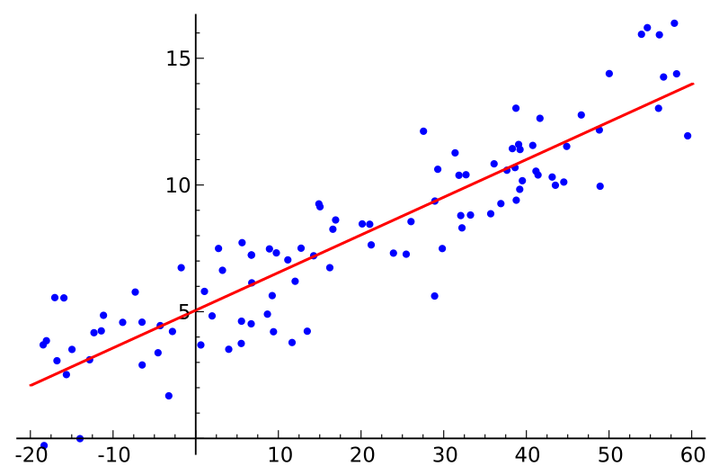
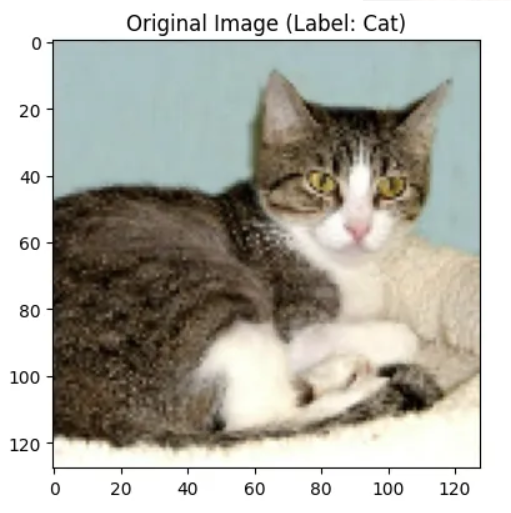
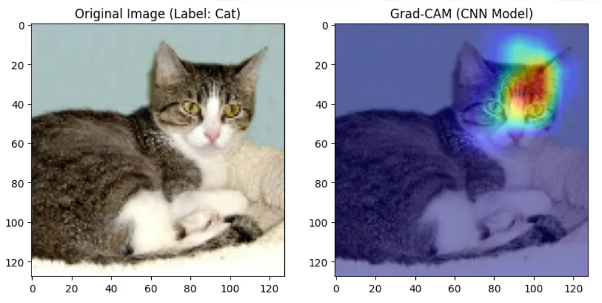
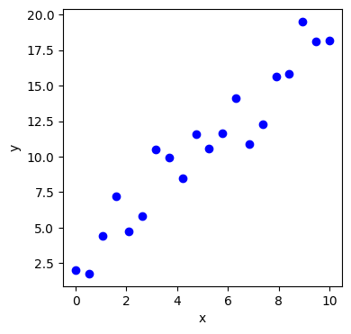
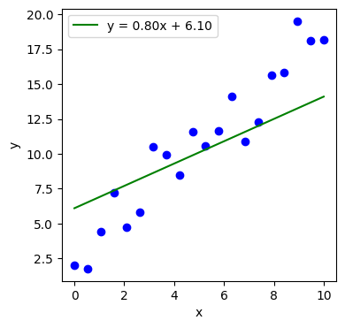
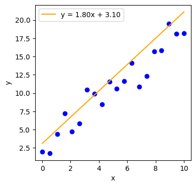
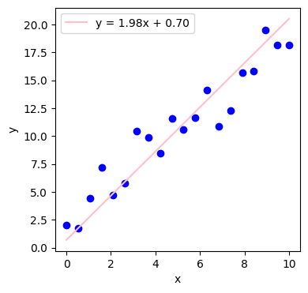
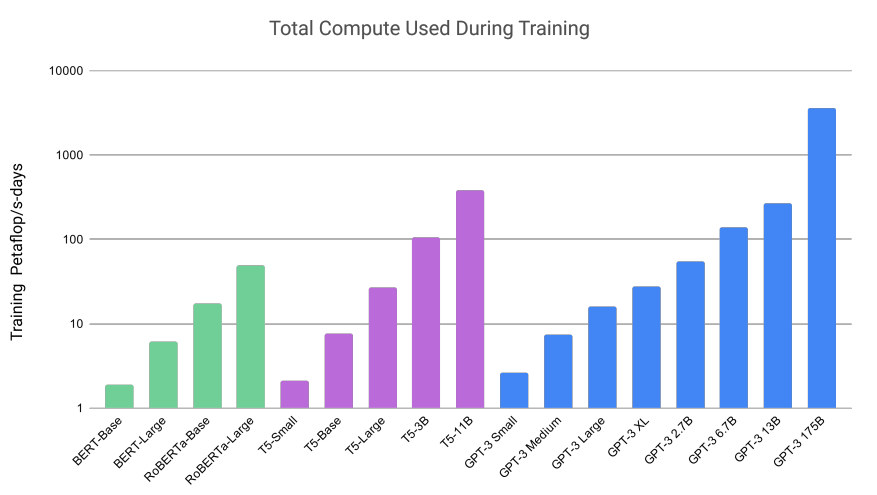

# Jak se trénuje AI

- statistika / pravděpodobnost
- pokročilejší: word embeddings
- nejpokročilejší: transformer

--------------

### Co je neuron?

Neuron je výpočetní jednotka, která popisuje přímku

$$ y = ax + b $$

By Sewaqu - Own work, Public Domain, https://commons.wikimedia.org/w/index.php?curid=11967659

-----------------

### Co je parametr?\

Parametry *a* a *b*

$$ y = {a}x + {b} $$

a, b se někdy nazývají váha (weight) a zkreslení (bias)

$$ y = {w}x + {b} $$

-----------------

### Co je attention (pozornost)?

Ne všechna data jsou stejně důležitá

-----------------

### Co je attention (pozornost)?

Ne všechna data jsou stejně důležitá

-----------------

## Trénování

-----------------

## Iterace 0 - náhodná *w* a *b*

-----------------

## Iterace 1 - lepší *w* a *b*

-----------------

## Iterace X - nejlepší *w* a *b*

-----------------

## Trénování transformeru

- bohužel velká síť musí být celá v paměti počítače
- váhy a zkreslení se vzájemně ovlivňují
- lineární model má dva parametry, GPT-3 má 175 miliard parametrů
- trénování trvá dlouho

velká paměť + velký výkon = drahé počítače

-----------------

###  Výkon počítačů - FLOPS

- floating point operations per second
- běžný herní počítač má 100 gigaFLOPS (10e11) - 10 teraFLOPS (10e13)
- výkon superpočítače LUMI: 531 petaFLOPS

{height=450px}

-----------------

### Jak dlouho trénování trvá?

- výpočet se měří v petaFLOPS (10e15) za den počítání

-----------------

### Co to znamená?

- stovky tisíc až miliony kWh na trénování jednoho modelu
- uhlíková stopa GPT-3 je 502 tun CO2
- spotřeba vody na trénink GPT-3 je 700 000 litrů

Pro srovnání

- průměrná spotřeba domácnosti za rok

  - 3500 kWh
  - 32000 l vody

