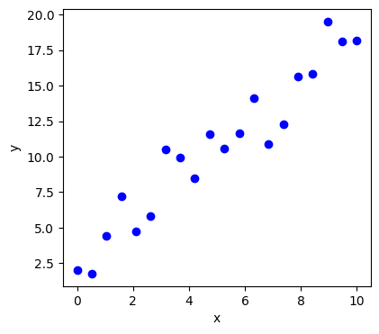
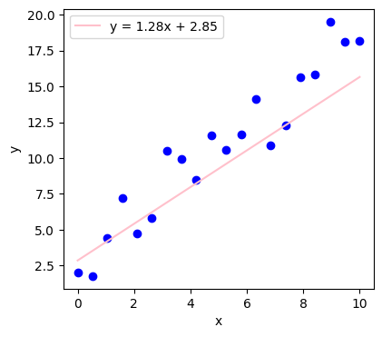
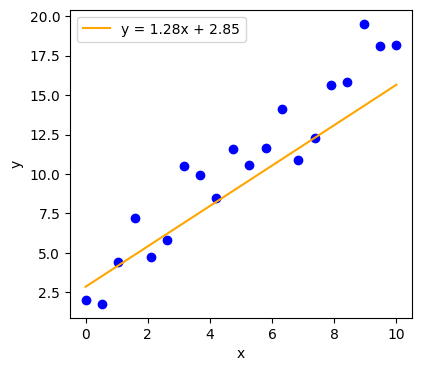
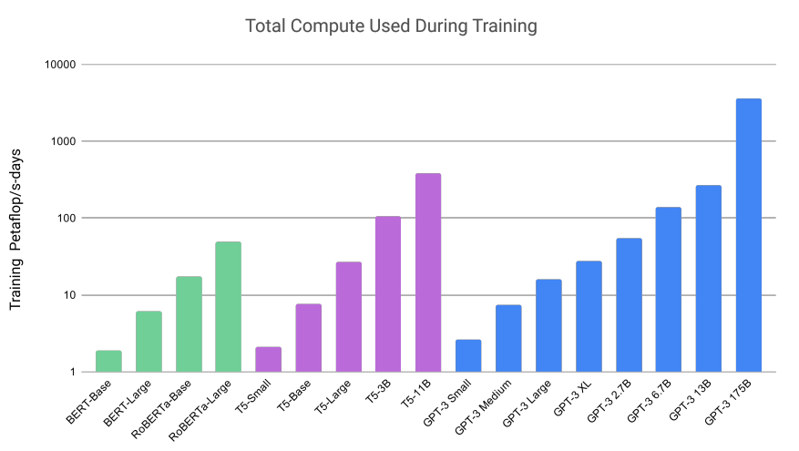

# Jak se trénuje AI

- statistika / pravděpodobnost
- pokročilejší: word embeddings

## Transformer (transformátor)

- druh neuronové sítě, který všechno změnil
- díky *attention* dokáže zachytit závislosti mezi slovy, přestože je mezi nimi velká vzdálenost
- aby to bylo možné, musí být transformer dost velká síť

---

## Co je velikost sítě?

Neuron je výpočetní jednotka, která popisuje přímku

$$ y = ax + b $$

By Sewaqu - Own work, Public Domain, https://commons.wikimedia.org/w/index.php?curid=11967659

---
### Co je parametr?

$$ y = {\color{red}a}x + {\color{blue}b} $$

a, b se někdy nazývají váha (weight) a zkreslení (bias)

$$ y = {\color{red}w}x + {\color{blue}b} $$

---
## Trénování

---
## Iterace 0 - náhodná *w* a *b*

---

## Iterace 1 - jiná *w* a *b*

---

## Iterace X - nejlepší *w* a *b*

---
## Trénování transformeru

- bohužel velká síť musí být celá v paměti počítače
- váhy a zkreslení se vzájemně ovlivňují
- lineární model má dva parametry, GPT-3 má 175 miliard parametrů
- trénování trvá dlouho

velká paměť + velký výkon = drahé počítače

---
###  Výkon počítačů - FLOPS

- floating point operations per second
- běžný herní počítač má 100 gigaFLOPS (10e11) - 10 teraFLOPS (10e13)
- výpočet se měří v petaFLOPS (10e15) za den počítání

---
### Kdo má tak výkonné počítače?

- výkon superpočítače LUMI: 531 PFLOPS/s

