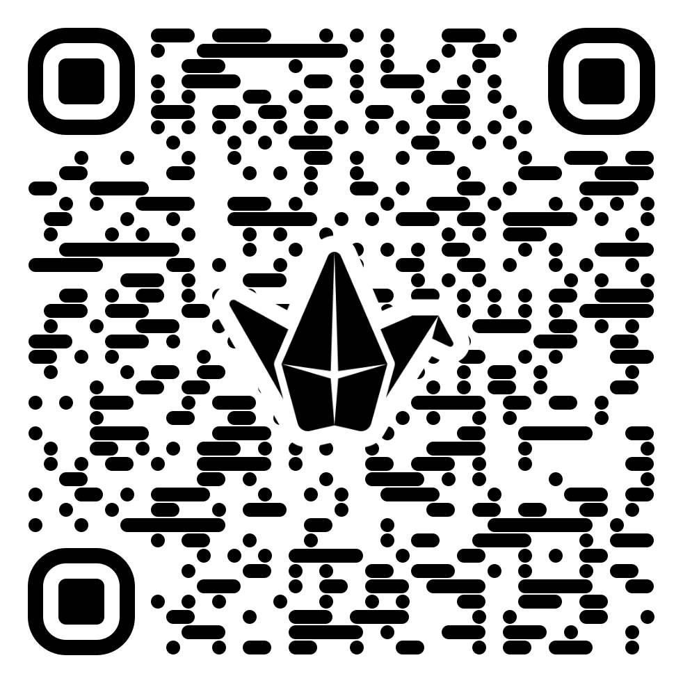

# Užitečné nástroje

Není jedna AI, která vládne všem (zatím).

{height=500px}

Selrond https://www.deviantart.com/selrond/art/One-Ring-To-Rule-Them-All-507183083

---

## Opravy textu

- Grammarly - minimální korektura, respekt k autorovi, nastavení AmE/BrE, nastavení stylu atd.
- ChatGPT, Mistral, Claude - někdy texty upravují víc, než můžeme chtít

---

## Překlad

- DeepL - překlad ok, ale neumí zachovat strukturované informace
- ChatGPT a další mají tendenci vykonat, co je v textu a ne přeložit
  - Přelož do angličtiny: Přelož do japonštiny "Kolik třešní, tolik višní"...

---

## Organizace materiálů

- Elicit
- NotebookLM
- ExplainPaper
- scite.ai

---

## Generování multimédií

- NotebookLM vygeneruje myšlenkovou mapu, podcast
- Lumen5 vygeneruje doprovodné video

  - https://lumen5.com/user/10196519/upoutavka-k-clanku-b5v7s/

---

## Detekce generovaného obsahu

- SightEngine: https://dashboard.sightengine.com/ai-image-detection

- Winston AI: https://gowinston.ai/

- Content at Scale: https://contentatscale.ai/ai-content-detector/

- ZeroGPT: https://www.zerogpt.com/

---

## Psychická podpora

- Elin.ai - český projekt, kde je nízké riziko zneužití citlivých dat

---

## Přidejte své oblíbené neuronové sítě

https://padlet.com/popelucha/n-stroje-ai-ozxandxd6f8vy94m
{height=400px}
