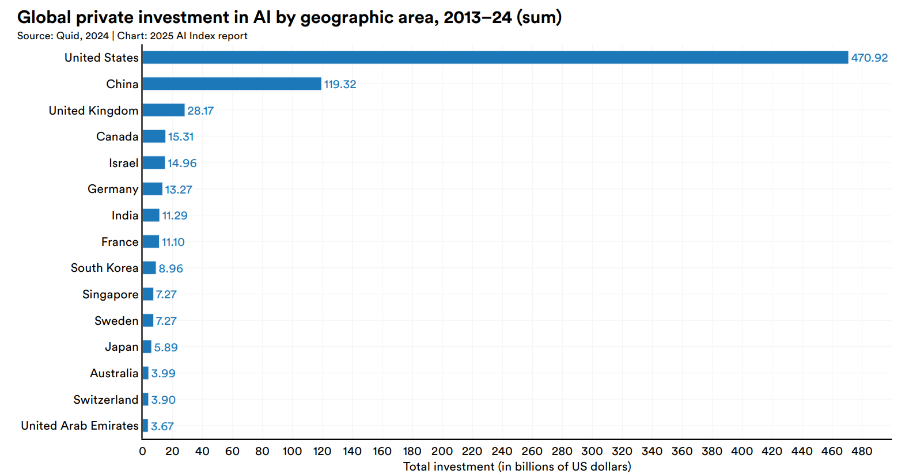
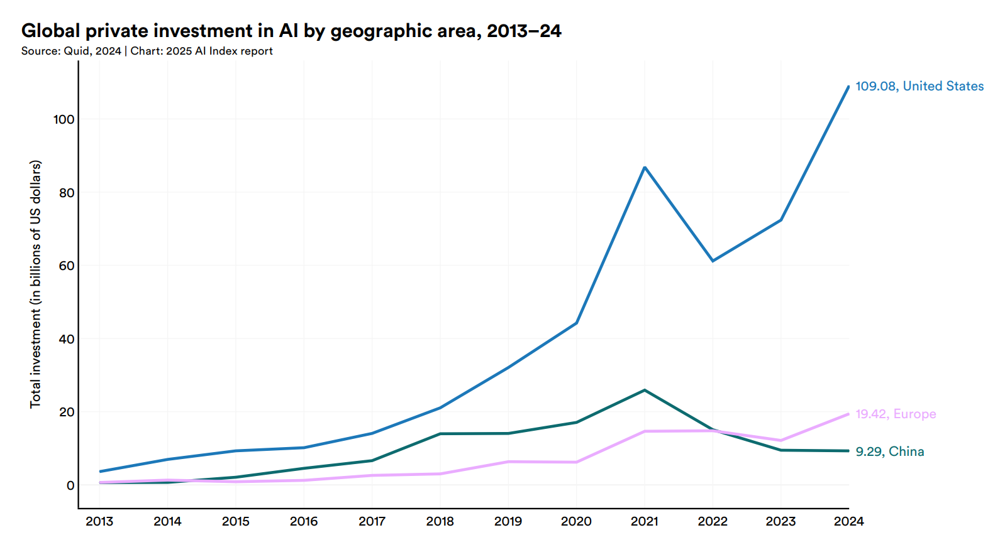
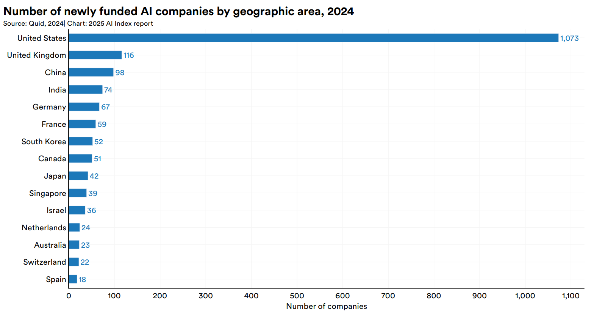
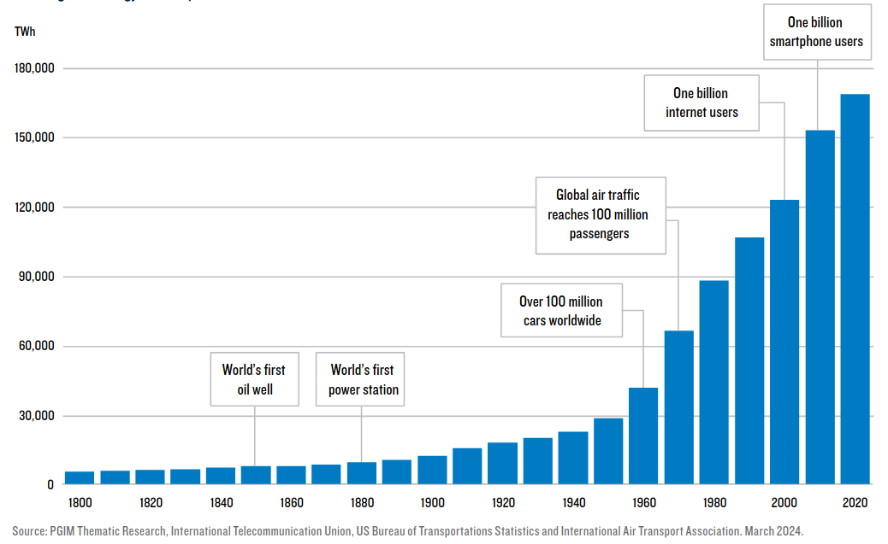

# AI, byznys, politika

## Historie

- myšlenka autonomního stroje, který se bude rozhodovat podle informací, které dostane z prostředí, je velmi stará (antika, Leonardo da Vinci, golem, ...)
- slovo "robot" 1921 (ze slova "robota")
- první robot 1928 Gakutensoku (Makoto Nishimura)

> Charakter umělých lidí je určen záměry jejich tvůrců. A záměrem humanoidů táhnoucích kočáry na parní pohon bylo vytvořit dělníky zotročené svými lidskými pány. *To* by podle Nishimurova názoru nevyhnutelně vedlo k vytvoření vykořisťované podtřídy ve stylu *RUR*, která by se musela vzbouřit.
>
> --- Yulia Frumer: The Short, Strange Life of the First Friendly Robot

---

### Gakutensoku - ten, který se učí z přírody

{height=450px}

---

### AI je věda

- termín "umělá inteligence" je z roku 1955 (John McCarthy)
- termín "strojové učení" je z roku 1959 (Arthur Samuel)
- první průmyslový robot Unimate z roku 1961
- chatbot Eliza je z roku 1966
- 1979 autonomní vozítko projelo samo prostředím plným překážek

---

### AI je věda, která má výsledky

- 1954 strojový překlad z ruštiny do angličtiny (Georgetownský experiment)
- 1986 první auto bez řidiče (Bundeswehr University, Mnichov)
- 1997 Deep Blue porazil Garyho Kasparova
- 1997 rozpoznání řeči ve Windows
- 2003 Spirit a Opportunity přistály na Marsu
- 2011 Watson vyhrál Jeopardy!
- 2012 neuronová síť na rozpoznání koček (Andrew Ng, Jeff Dean)

---

### AI je byznys

- z výzkumné (nevýdělečné) oblasti se přehoupla do byznysu 
- 1980 expertní systém XCON pomáhal sestavovat počítače z komponent
- 1990 první doporučovací systém (recommender system) "digital bookshelf"
- 2002 robotický vysavač Roomba
- 2006 Twitter, Facebook a Netflix začaly používat AI ve svých algoritmech
- 2011 Siri
- 2015 OpenAI

> “If you think about the things that are most important to the future of the world, I think good AI is probably one of the highest things on that list. So we are creating OpenAI. The organization is trying to develop a human positive AI. And because it’s a non-profit, it will be freely owned by the world.”
> 
> --- Sam Altman

---

### AI zasahuje do politiky

- Zájem (a financování) AI

{height=500px}

- 2017 robot Sophia (od Hanson Robotics) získává občanství v Saúdské Arábii

---

### Financování AI: USA vs. Čína? (2024)

{height=550px}

---

### Financování AI: USA vs. Čína? (celkem)

{height=550px}

---

### Financování AI: Co Evropa?

{height=550px}

---

### AI firmy založené v roce 2024

{height=550px}

---

### AI firmy celkem

{height=550px}

---

### AI firmy: umí Evropa inovace za méně peněz než USA?

{height=550px}

---

### AI a energie

{height=550px}

---

### AI a energie

- v současnosti datacentra spotřebovávají 2 % energie (víc než Francie)
- v roce 2026 se očekává, že to budou 4 % (tolik, co Japonsko)
- výstavbu datacenter limituje energie (na provoz a chlazení)

  - datacentra poháněná zero-carbon energií 
  - datacentrum Amazonu v Pensylvánii u jaderné elektrárny
  - Microsoft investuje do jaderné elektrárny Three Mile Island

---

### AI, energie a Česká republika

{height=550px}

