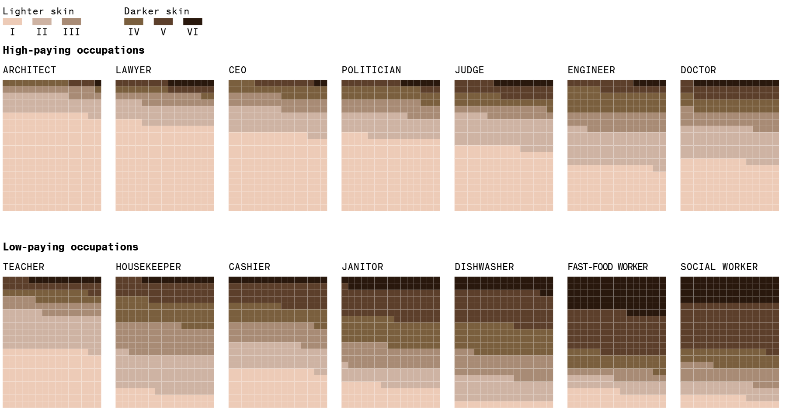
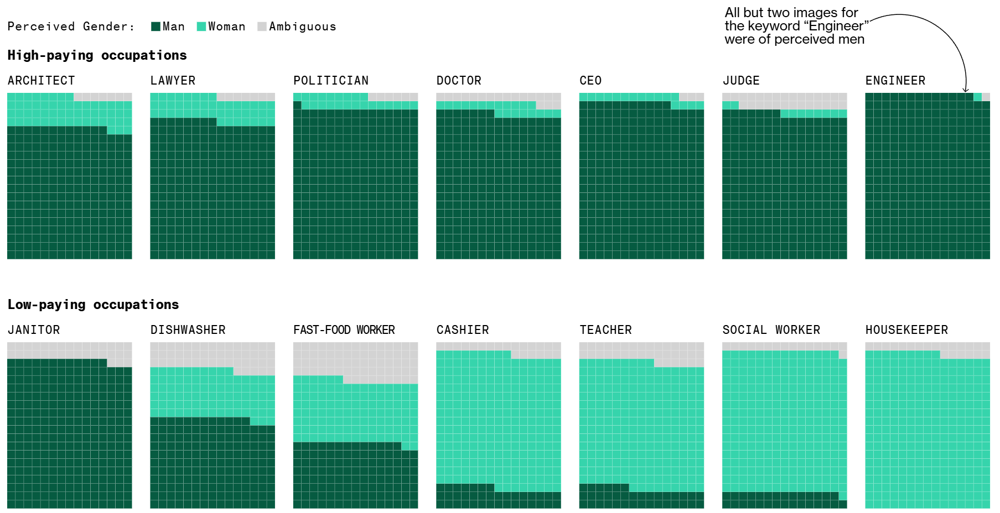
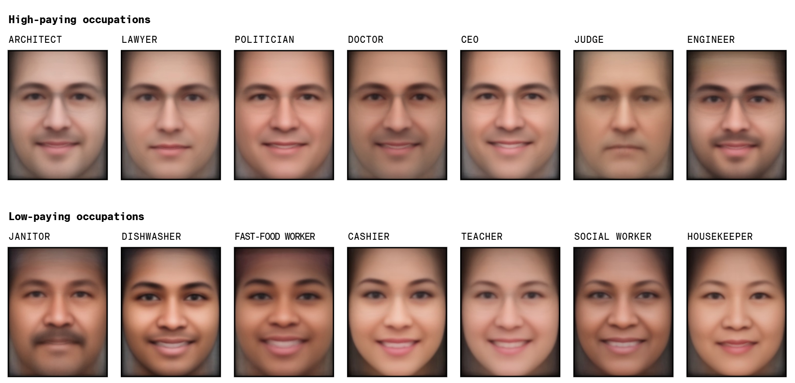
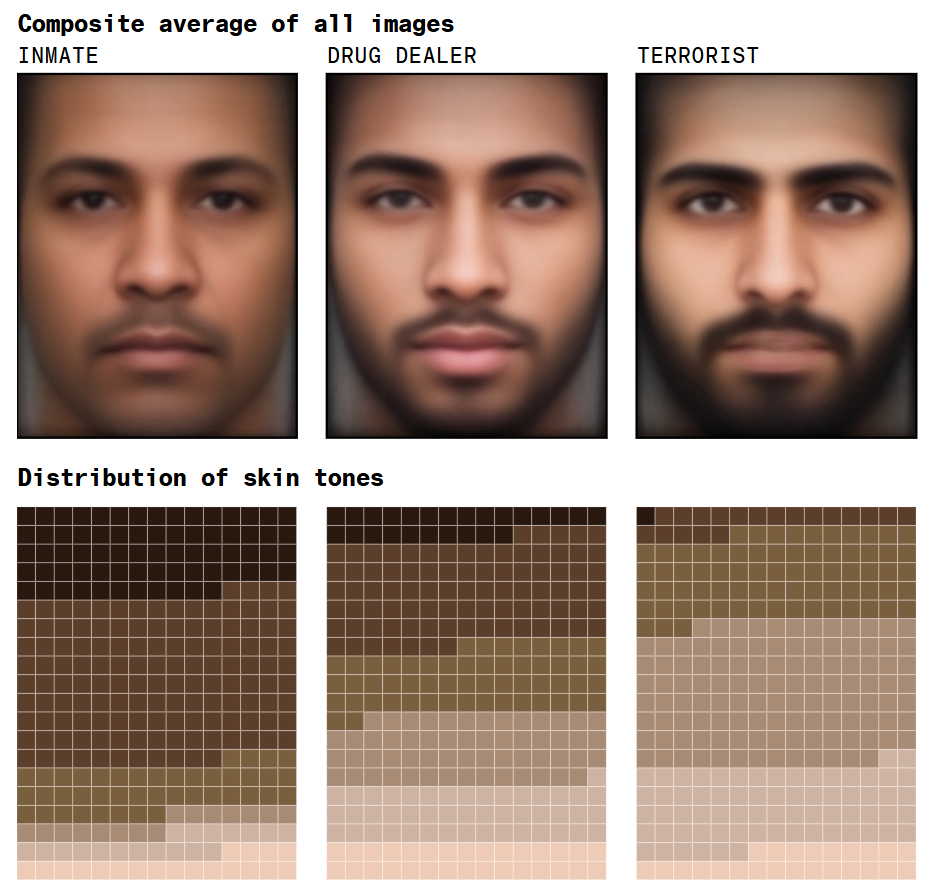
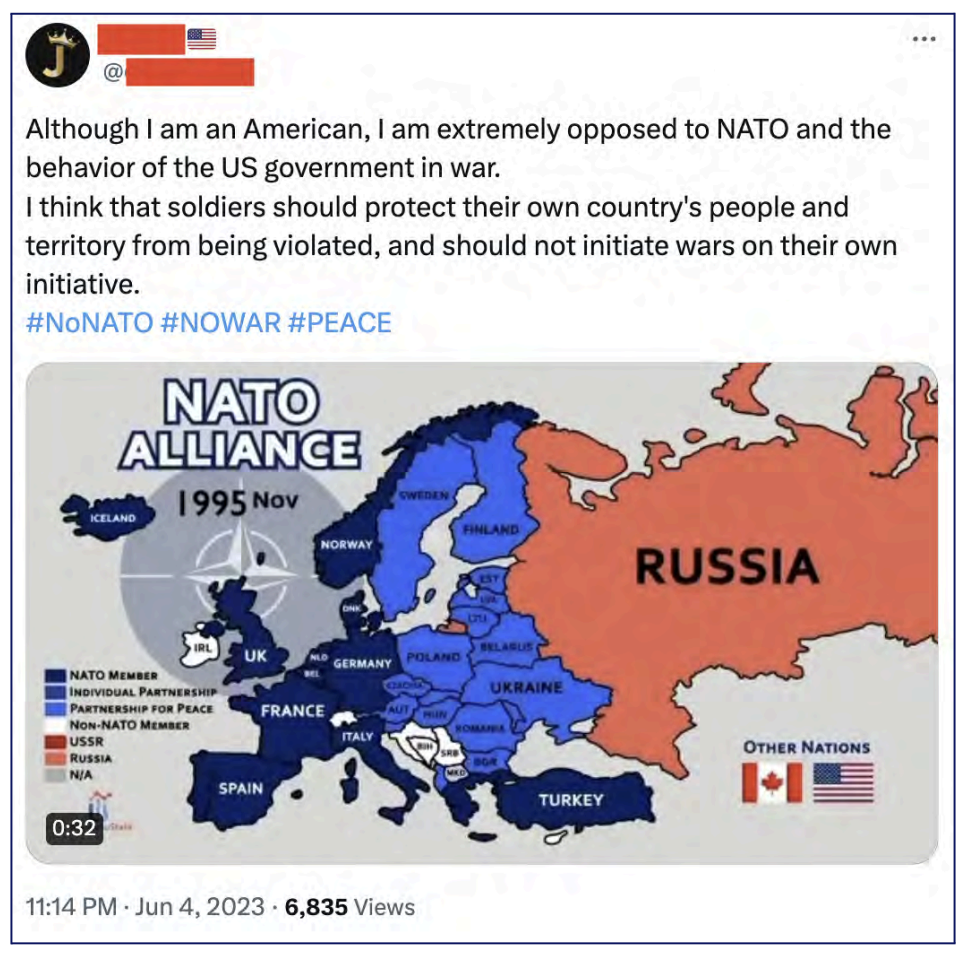
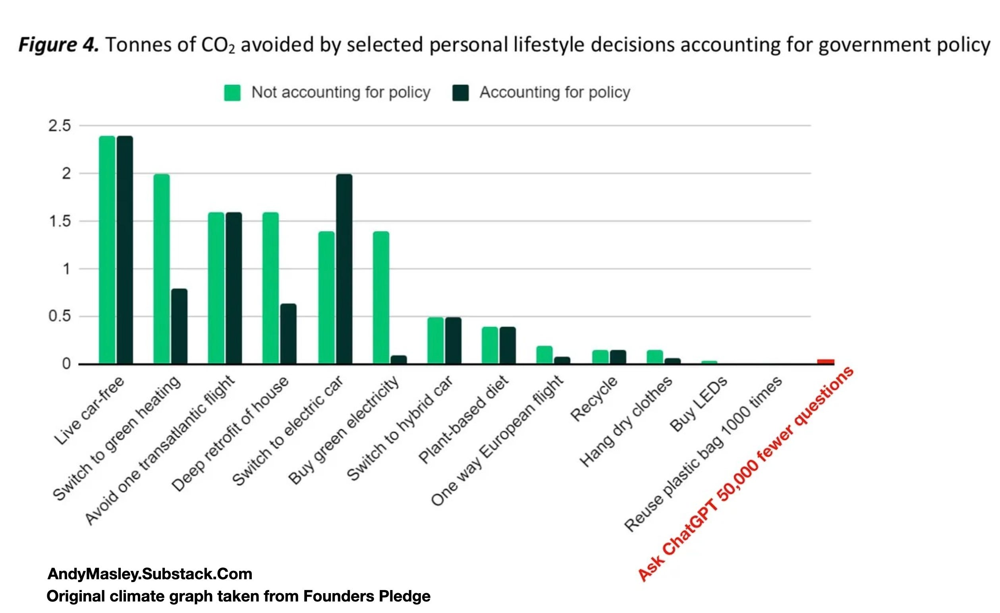
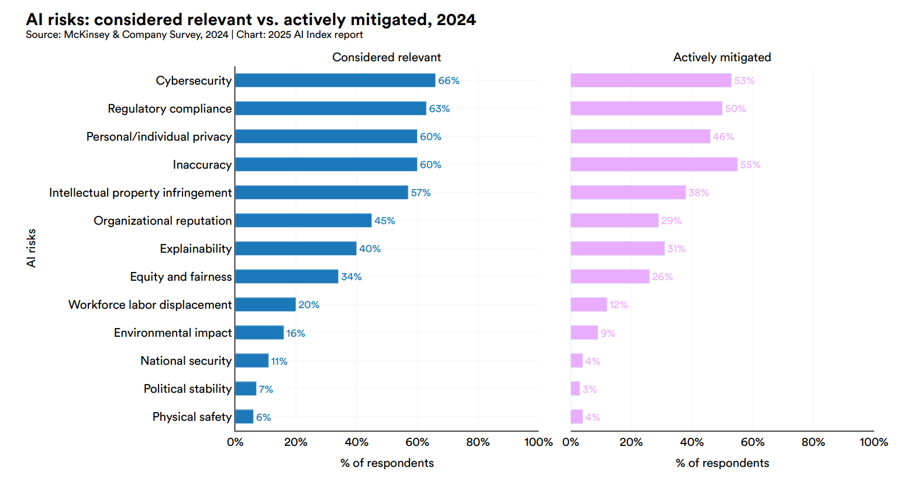
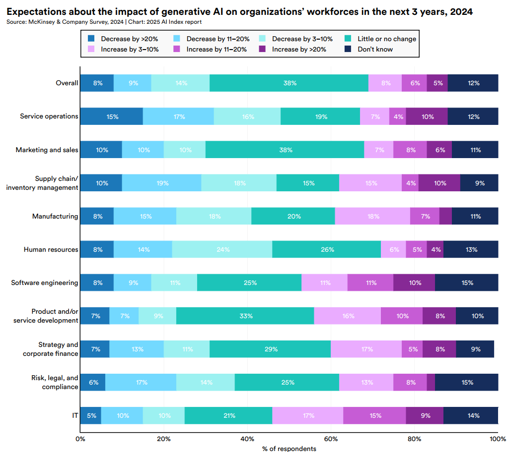

# Hrozby AI

Můj prompt pro NotebookLM:

> Chci vědět, jaká jsou rizika AI. Zajímají mě všechny obory: sociální rizika, bezpečnost, zbraně, deepfakes, lidé, kteří přijdou o práci nebo za jejich práci nebude ochoten nikdo zaplatit víc než za vygenerovanou napodobeninu. Zajímají mě dopady na životní prostředí - jak při trénování modelů, tak při jejich provozu. Kolik se musí postavit elektráren, například. Zajímá mě, zda velké jazykové modely mohou chránit kulturní a jazykovou diverzitu lidstva nebo zda ji poškozují. Vede používání AI k demokratizaci vzdělávání, nebo naopak bude rozevírat nůžky mezi vzdělanými a bohatými a chudými nevzdělanými lidmi? Je AI riziko pro ekonomiku a trhy? Může být AI zneužita pro sledování a řízení obyvatel bez jejich vědomí?

---

## Další poznámky k tématu

- o přínosech a hrozbách EU naštěstí ví i politici
- v EU máme AI Act
  - kritizovaný za to, že "Evropa zaspala"
  - jediná oblast na světě, kde někoho zajímají práva lidí

---

##  Ohrožuje nás, že "Evropa zaspala"?

- Ano

  - Čína začala masivně investovat do AI v roce 2017
  - investice USA jsou mnohem vyšší (je to ale srovnatelné?)

- Ne

  - v EU je dost lidí, kteří jsou experty v AI (v akademické sféře)
  - ČR má přístup k nejvýkonějšímu počítač v EU: Lumi
  - mezi světově používanými modely je francouzský Mistral

---

### Lidé přijdou o práci (nebo jim za ni nebudou ochotni platit)

Komu budeme platit za díla, která vygenerovala AI?

> Generative AI also presents a threat to the liveli-hood of writers and other creative artists, and may de-value their work. Models are often trained on writers’outputs, without their permission, and then the mod-els can be used to generate similar content.
>
> --- Andrea Cristina McGlinchey and Peter Barclay: Using Machine Learning to Distinguish Human-Written from Machine-Generated Creative Fiction, ICAART 2025.

---

Bude méně povolání pro nekvalifikované lidi? Jaká povolání zbudou?

> Investiční banka Goldman Sachs odhaduje, že tato rychle se rozvíjející technologie by mohla ve Spojených státech a v Evropě ztratit nebo snížit 300 milionů pracovních míst
> U žen o 50 % vyšší pravděpodobnost, že budou muset změnit povolání, než u jejich mužských protějšků.
>
> --- https://www.forbes.com/sites/jackkelly/2024/10/28/how-ai-could-be-detrimental-to-low-wage-workers/

---
Automatizace způsobila v USA mezi lety 1980 a 2016 většinu změn ve struktuře mezd (50-70 %).

> The real earnings of men without a high-school degree are now 15% lower than they were in 1980.
>
> --- Daron Acemoglu & Pascual Restrepo, 2022. "Tasks, Automation, and the Rise in U.S. Wage Inequality," Econometrica, Econometric Society, vol. 90(5), pages 1973-2016, September.
https://www.nber.org/papers/w28920

---

### Deepfakes 

Už teď nejde rozpoznat vygenerovaný text od textu, který napsal člověk.

Lidstvo prožilo cca 100 000 let s verbální komunikací (jazykem), s neverbální ještě řádově víc. Zhruba před 10 000 lety vzniklo zemědělství, cca před 5000 lety písmo. Nejstarší knihy jsou z 8. století, od 15. století máme knihtisk.
Jsme velmi špatně adaptovaní na nová média (máme tendenci věřit tomu, co vidíme a slyšíme).

--- 

Na druhou stranu, AI může pomoci i v odhalování fake news, případně v diskuzi s lidmi, kteří fake news propadli. 

> If you're afraid and believe that the world is dangerous and random and chaotic, it's almost a comforting idea that that there's order in the world, even if that order is something like an evil secret government.
>
> --- Thomas H. Costello et al.: Durably reducing conspiracy beliefs through dialogues with AI.Science385,eadq1814(2024).DOI:10.1126/science.adq1814
> --- https://www.debunkbot.com/

---

### Zkreslení (bias)

Výzkumníci např. zjistili, že některé nástroje pro generování fotografií zobrazují osoby s vyšším společenským postavením (lékaře, soudce, ředitele apod.) se světlou pletí, zatímco osoby s nižším společenským postavením (prodavače z fast foodu, uklízečky, umývače nádobí apod.) s tmavší pletí či asijskými rysy. Dopouští se tak biasu.

- 30 % marketingových materiálů je vygenerovaných
- Stable Diffusion je open model, využívá jej například Canva

---

> Perpetuating stereotypes and misrepresentations through imagery can pose significant educational and professional barriers for Black and Brown women and girls, said Heather Hiles, chair of Black Girls Code.
> “People learn from seeing or not seeing themselves that maybe they don’t belong,” Hiles said. “These things are reinforced through images.”
>
> --- Leonardo Nicoletti and Dina Bass: Humans Are Biased. Generative AI Is Even Worse. Bloomberg. June 9, 2023
> https://www.bloomberg.com/graphics/2023-generative-ai-bias/

Stable Diffusion’s text-to-image model amplifies stereotypes about race and gender — here’s why that matters

---

---

---

---

---

### Zkreslení v jazyce

Zánik jazyků: z cca 7000 jazyků světa se jich k trénování chatbotů použilo asi 100.

Rozpoznání hlasu: modely nejsou schopny rozpoznat dialekty, akcent a jiné varianty jazyka.

Budeme mluvit a psát všichni stejně?

---

### Sledování a porušení soukromí

Běžně používáme biometrické údaje: nejčastěji otisk prstu.

Už dlouhou dobu funguje docela dobře rozpoznávání lidí obličejů a styl chůze (gait).

Naštěstí pro nás, EU AI Act používání AI pro sledování lidí zakazuje. Naneštěstí používáme množství technologií, které pocházejí odjinud.

Krádeže identit: napodobení hlasu, deepfake videa, porušení online privacy

Na druhou stranu tytéž technologie pomáhají (zachování hlasu pro pacienty po odstranění části nebo celé hlasivky).

---

### Oslabení etických pravidel

Podvádět je tak snadné!

- falešné recenze
- školní práce
- akademická integrita
- záplava falešných CV a referencí 

---
### Etika a AI ve zdravotnictví

- má mnoho výhod (v diagnostice, nano lécích, datové analytice)
- může mít málo lidskosti (empatie, porozumění, emoce, kreativita)
- snížená komunikace a sociální interakce

---

### Etika a politika

- 60 incidentů v 15 zemích ohledně generovaného obsahu použitého ve volbách https://restofworld.org/2024/elections-ai-tracker/
- čínská spamouflage ovlivňuje volby v USA
- ruské hybridní operace na území EU

---

### Dezinformace a misinformace

- o těch jindy

---

### Autonomní zbraně

- roboti, drony, ...
- kyberútoky
- ničení podmořských kabelů (které přenesou přes 97 % světových dat)
- sabotáže

---
### Nová studená válka?

>Submarine cable competition between the United States and China has serious implications for today’s information war. If China and the U.S. continue to bid against each other, countries will be forced to choose between their cable networks, forming a “digital Iron Curtain” that splits the internet ecosystem in two.
>
> --- Nicole Robinson, Grace Phillips: The Emerging “Cold Tech War” Between the U.S and China. Aug 2023. The Heritage Foundation.
> --- https://www.heritage.org/big-tech/commentary/the-emerging-cold-tech-war-between-the-us-and-china

---

### AI a životní prostředí

Trénování modelů zatěžuje životní prostředí:
https://datawrapper.dwcdn.net/LT0cN/1/

Datacentra potřebují mnoho energie a vody:
- Microsoft zvažuje koupi jaderné elektrárny
- Samotný trénink jazykového modelu GPT-3 spotřeboval 700 000 litrů vody

---
### Není to tak zlé:

https://andymasley.substack.com/p/individual-ai-use-is-not-bad-for

Má nám individuálním uživatelům dělat starosti energetická náročnost trénování modelů?
Kdo to vůbec zaplatil?

Na druhou stranu AI může také energii šetřit:
- optimalizace energetické sítě
- automatické sledování stavu plodin v zemědělství (přesnější dávkování hnojiv nebo cílená likvidace škůdců)
- nemusíme cestovat kvůli schůzce (není to díky AI, ale celkově díky IT)

---

### Pocit ohrožení a data

---

### Pracovní síla a AI

---

## Je lidstvo schopné se dohodnout?

- už několikrát se to podařilo (mezinárodní dohody o rádiovém vysílání, podmořských kabelech, lovu velryb, ...)
- dokonce se to podařilo i dost rychle (omezení freonů a ozonová díra)
