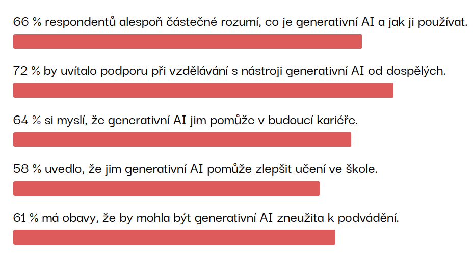
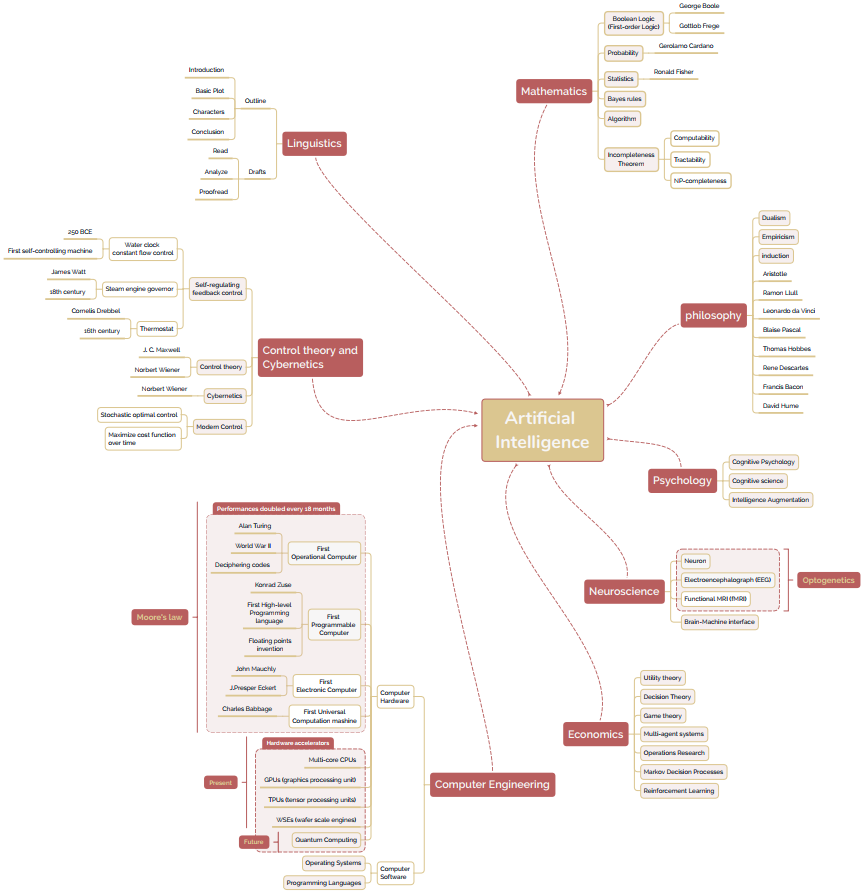

# Proč se dozvědět o AI víc

Největší výzvy dneška spojené s AI:
- misinformace, dezinformace
- zbraně řízené AI
- ochrana soukromí a duševního vlastnictví
- sociální témata (změna pracovního trhu, změna vzdělávání, ...)
- energie

---

# Co my s tím?

> The pressing need to prioritize a better approach to building AI is evident. To do so, it is necessary to reimagine an educational program where AI competencies, inclusive of building a lens interrogating the ethics of AI in addition to technical creation, are seen as core to preparing students for a technology-powered future. 
>
> --- The AI Report 2025

---

# Pojďme AI rozumět

--- 
# AI zasahuje do mnoha oblastí

...najděte tu svou

